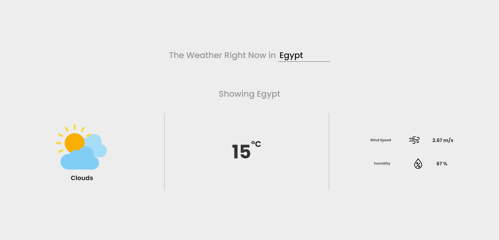
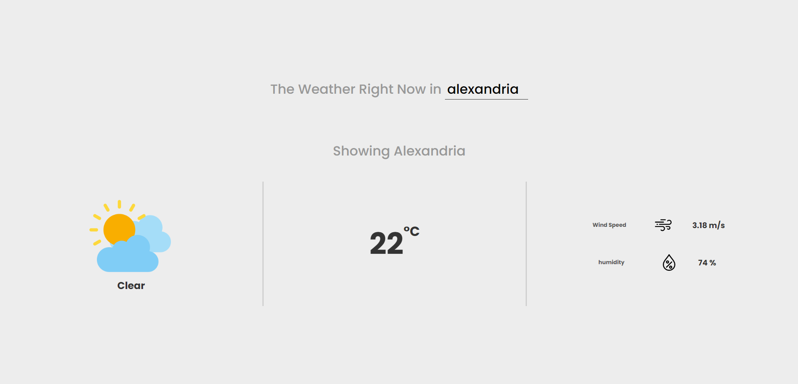

# Weather App

I built this app (website) as a way to teach myself how to fetch data from APIs and update the UI accordingly. You can check out the app on [Vercel](https://weather-app-magdykishk.vercel.app/).

 

## About the API

The API used in this project is [OpenWeatherApi](https://openweathermap.org/).

 

## What I Learned While Coding It

While coding this app, I learned how to use APIs, which will allow me to be more creative in the future. I also learned how to deal with asynchronous functions in JavaScript.

 

## About the UI

The UI was inspired by [Matthew Kosloski's](https://dribbble.com/matthewkosloski) weather app.

 

## Some Pictures

 

## What Changes Would I Make If I Rebuilt It Again

If I were to rebuild this app again, I would try to make it more interactive with more animations. I would also add the ability to show temperatures in Kelvin and Fahrenheit, not only Celsius. Additionally, I would make the image indicating the weather state change depending on the weather.
